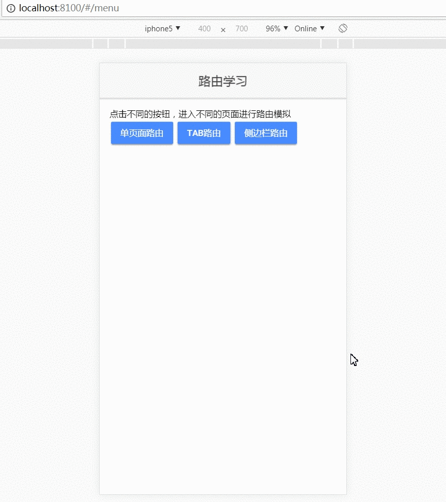
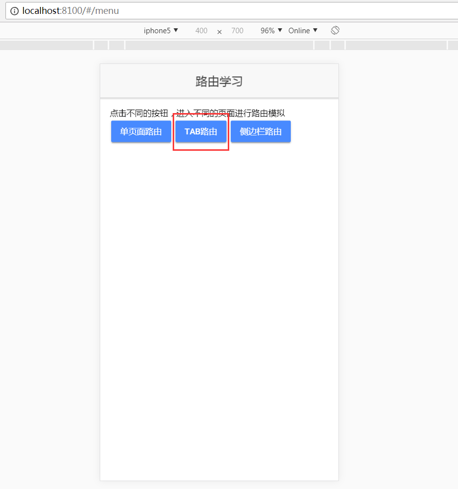
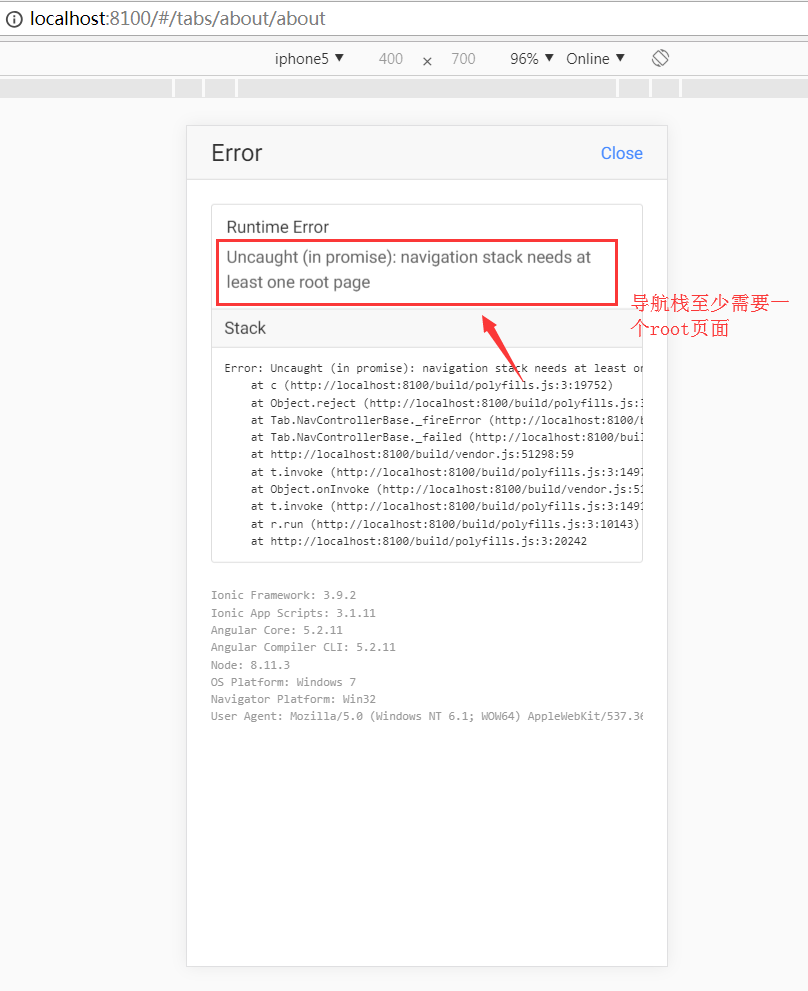

# Ionic路由说明
[TOC]
## 一、单页面

>目的一：单页面进行push，并返回上一级
>目的二：单页面进行setRoot(),并返回上一级

### 1.1 目的一

#### 1.1.1 效果图



#### 1.1.2 模拟代码

```
  //进入pushsingle页面，并传递参数名为test值为my god
  openPushPage(){
    this.navCtrl.push('PushsinglePage',{test: 'my god'});
  }
  
  // pushsingle页面获取参数
   constructor(public navCtrl: NavController, public navParams: NavParams) {
    this.test = this.navParams.get("test");
  }

```
### 1.2 目的二

#### 1.2.1 效果图

#### 1.2.3 模拟代码
```
 	// 将【setrsingle】页面设置为根页面
   openStrPage(){
    this.navCtrl.setRoot('SetrsinglePage',{title:'test the param'})
  }

  // 返回单页面测试路由，实质是将【单页面测试路由】设置为根页面。缺点：无法回到【路由学习】页面
  openNextPage(): void {
      this.navCtrl.setRoot('SinglePage')
  }
```
### 1.3 结论
> 1. 如果页面有``<ion-navbar>``，则后退按钮将自动添加到推送视图。
> 2. ionic APP中的页面实质上是一个栈的结构，但从当前页面上引入一个新页面时，浏览器（或操作系统）会加载新页面的资源，然后把它添加到栈顶。在界面上的表现就是，新页面“遮住了”原有的页面，下层页面的内容和资源依旧在内存中。
> 
> 而上层页面被pop掉的时候，上层页面弹出栈，相应的内存被释放（在图中栈顶由C变成了B），在视觉表现上就是上面的页面被“移开”了，下层的页面“暴露了出来”。
> 
> 所以APP中的页面是有层级关系的，用户在首页一层一层地进入了新页面（A->B->C），回到首页时就得一层一层退出来（C->B->A），
> 如果将某个页面设置为根元素，也就是将栈清空该页面入栈。


## 二、tab页面

>目的一： 从[路由学习页面]push页面进栈，返回上一级（报错）
>目的二： 从tab页面进入到其他页面，然后返回上一级

### 2.1 目的一
#### 2.1.1 效果图


无返回上一级的按钮，那么人为添加按钮，返回上一级。

加入按钮



####2.2.2 模拟代码
- 页面代码
```
<ion-content padding>
    注意看，是否能回到上一级。<br/>
  <button ion-button (click)="gotoPrevious()">返回[路由学习]界面</button>
</ion-content>
```

- ts代码：
```
  gotoPrevious(): void {
    this.navCtrl.pop();
  }
```

### 2.2 目的二
#### 2.2.1 效果图


点击人为添加的返回按钮，返回contact页面

同理about页面也进入下一级页面


#### 2.2.2 模拟代码
```
  // 返回上一级
  gotoPrevious():void{
    this.navCtrl.pop();
  }
  
  // 到下一个页面
  gotoNext(): void {
    this.navCtrl.push('NextPage');
  }
```

###2.4 结论
>1. 从某个界面push一个tab界面，其实质同setRoot()方法是同样的，重新设置了根页面。如果从tab的每个页面试图返回上一级，则会报导航栈至少需要一个root页面。
>2. 从某个页面push（路由）到另一个页面，默认都会加上一个返回箭头返回到上一个页面；如果没有，则可能被路由的页面被设置为了根页面，无法返回上一个页面。
>3. Tabs可以被理解为一个特殊的页面，这个页面中又包含了若干个页面栈（Tab），每个页面栈相互独立，通过Tab按钮来相互切换。一个页面栈中的push和pop不会影响到其它栈的表现，也就是当你在不同的tab中切换时，看到的是响应的栈顶页面。如图

## 三、侧边栏页面

> 目的一： 从[路由学习页面]push页面进栈，返回上一级(报错)
> 目的二： 从list页面进入到其他页面，然后返回上一级

### 3.1 目的一
#### 3.1.1 效果图


#### 3.1.2 模拟代码
- 页面代码
```
<ion-content padding>
  注意是否能返回上一个页面！
  <button ion-button (click)="popPage()">返回的【路由学习界面】</button>
</ion-content>
```
- ts代码
```
  popPage():void{
    this.navCtrl.pop();
  }
```


### 3.2 目的二
#### 3.2.1 效果图


#### 3.2.2 模拟代码
- 页面代码
```
<ion-list>
    <button ion-item *ngFor="let item of items" (click)="itemTapped($event, item)">
</ion-list>
```

- ts代码
```
 itemTapped(event, item) {
    // That's right, we're pushing to ourselves!
    this.navCtrl.push(ListPage, {
      item: item
    });
  }
```
### 3.3 注意
> 看代码，发现用的导航不是用的注入方式，而是使用一个注解进行路由。
> 如果采用注入的方式，具体效果如下：
> 
> 根据动图发现，菜单栏没有了，根据地址发现localhost:8100/#/list，当前list页面为根页面了,而之前的list地址为：
> 
> 原因如下：
> 

### 3.4 总结
>1.从某个界面push一个side界面，其实质同setRoot()方法是同样的，重新设置了根页面。如果从side的每个页面试图返回上一级，则会报导航栈至少需要一个root页面。
>2.从某个页面push（路由）到另一个页面，默认都会加上一个返回箭头返回到上一个页面；如果没有，则可能被路由的页面被设置为了根页面，无法返回上一个页面。

## 四、参考资料

https://ionicframework.com/docs/api/components/nav/NavPush/
https://ionicframework.com/docs/api/components/nav/NavPop/
https://segmentfault.com/a/1190000012145193#articleHeader13
http://www.ionic.wang/article-index-id-94.html